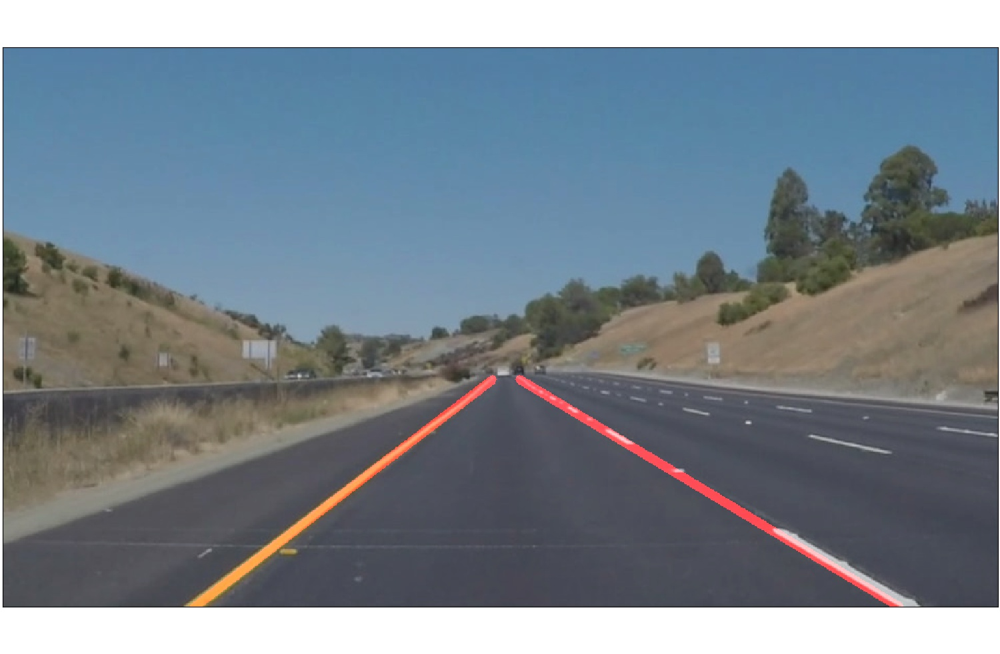

**Finding Lane Lines on the Road**

[//]: # (Image References)

[gray]: ./output/gray.jpg "Grayscale"
[blur]: ./output/blur.jpg "Blur"
[canny]: ./output/canny.jpg "Edges"
[masked]: ./output/masked.jpg "Masked"
[hough]: ./output/hough.jpg "Hough"
[hough_raw]: ./output/hough_raw.jpg "Hough + Raw"
[hough_lanes]: ./output/hough_lanes.jpg "Hough + Lanes"
[hough_lanes_raw]: ./output/hough_lanes_raw.jpg "Hough + Lanes + Raw"

---

### 1. The Pipeline
My pipeline consisted of 5 steps. 

First, I converted the images to grayscale
![alt text][gray]

Second, I applied guassin filter on the gray scale ouptut
![alt text][blur]

Third, Getting the edges of the image by appling canny edge detection
![alt text][canny]

Then masking the edges image to get the region that contain the lanes only
![alt text][masked]

By applying hough transform on the masked image to get the line of the lanes 
![alt text][hough]

In order to draw a single line on the left and right lanes, I modified the draw_lines() function by filtering the lines outputed from hough transform 
by checking the slope of the lines and append the lines of negative slope to left lane lines and positive slope to right lane lines.
then getting the weighted mean of left lines slpoe and y intercept and as well for the right lines to get the left line and right line that represent the lanes as shown bellow.
![alt text][hough_lanes]

Finaly the output merged to the input image would be 
![alt text][hough_lanes_raw]

### 2. potential shortcomings with my current pipeline
1- Many parmeters need to be optimized which could make the pipeline fail in some cases.
2- This pipeline will work for straight lines only not for curved lanes.

### 3. Possible improvements to your pipeline
1- Introduce some other techniques to track the lanes to output lanes in case of non detection